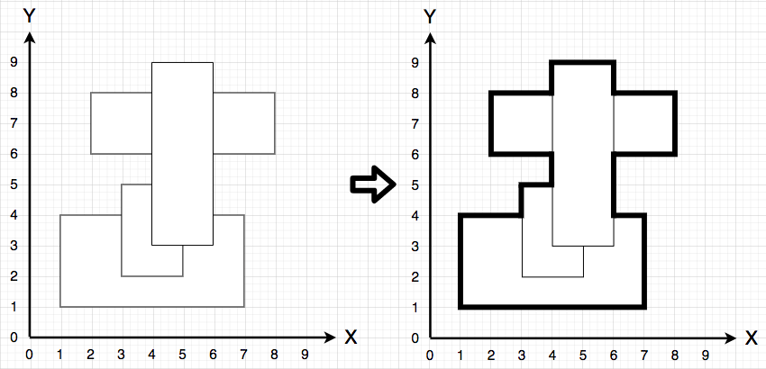
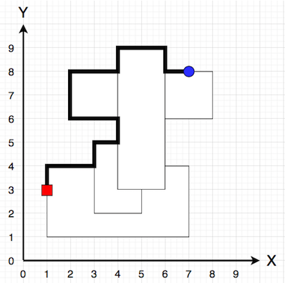

# [프로그래머스] 아이템 줍기
키워드: [`#bfs`](bfs_dfs.md)

[문제 링크](https://school.programmers.co.kr/learn/courses/30/lessons/87694)

## 해결 과정

이렇게 직사각형이 겹쳐있을 때 바깥 테두리를 어떻게 그리지? (좌측 하단 x1, 좌측 하단 y1, 우측 상단 x2, 우측 상단 y2)
1.  `x1<x<x2 && y1<y<y2`인 경우 일단 사각형 내부니까 0으로 표시
2.  일단 한 사각형의 모서리인데, 다른 사각형의 내부가 아니야(즉, 0으로 표시되지 않은 영역)->1로 표시
3.  1번과 2번 반복하면 결국 최외곽 테두리만 남는다.
4.  BFS로 최단경로 찾으면 끝
   