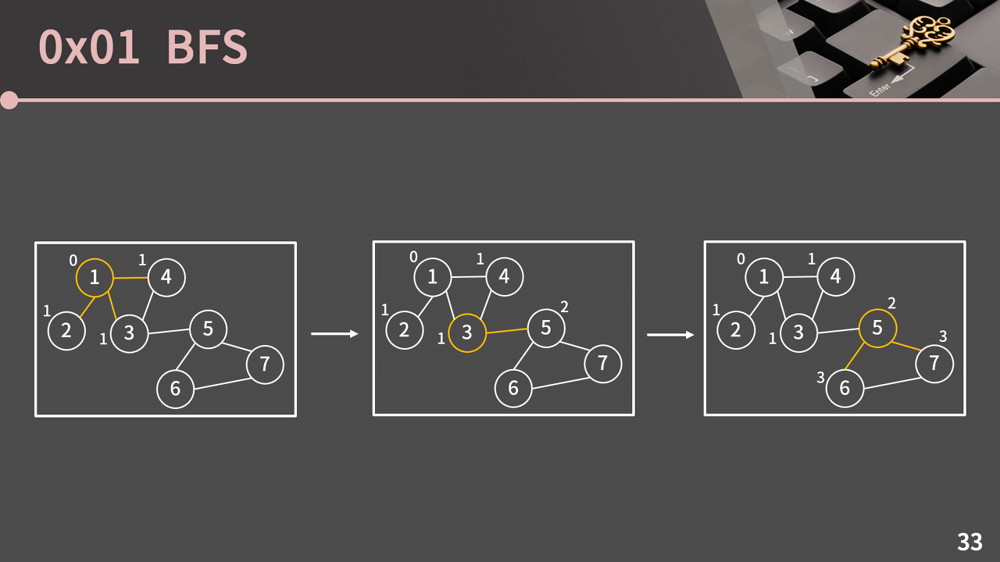
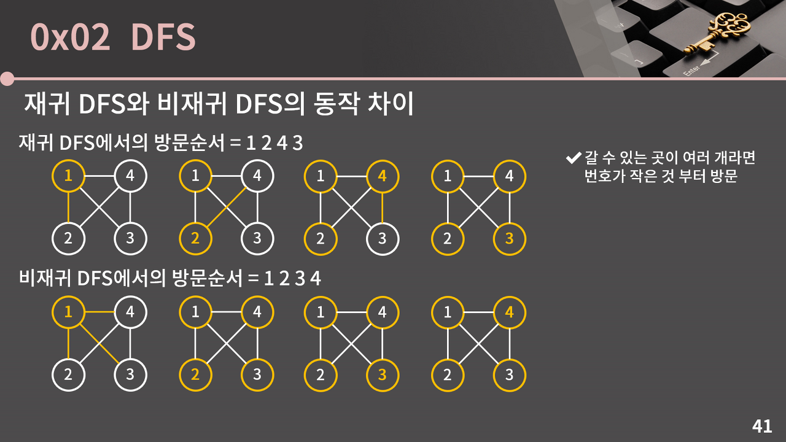

# BFS
Breadth First Search - 너비 우선 탐색  
다차원 `배열`에서 각 칸을 방문할 때 `너비를 우선으로` 방문하는 알고리즘

## 배열
### 과정
1. 시작하는 칸 1) `방문 표시`하고, 2) `큐`에 넣기
2. 큐에서 원소 꺼내서 인접한 4칸(상하좌우)에 대해 
   1. 이웃한 상하좌우 칸이 배열의 범위를 벗어나는지 확인
   2. 해당 칸을 방문한 적 있는지 확인
      - 처음 방문하면 `방문 표시` 남기고 `큐`에 넣기 
3. 큐가 빌 때까지 2번 반복

### 시간복잡도
칸이 n개일 때, $O(n)$

## 그래프
[`그래프`](./graph.md)에서 BFS는 `모든 노드를 방문`하기 위한 알고리즘
### 과정
1. 시작하는 정점 1) `방문 표시`하고, 2) `큐`에 넣기
2. 큐에서 정점 꺼내서 그 정점과 연결된 모든 정점에 대해 
   1. 해당 정점을 방문한 적 있는지 확인
      - 처음 방문하면 `방문 표시` 남기고 `큐`에 넣기 
3. 큐가 빌 때까지 2번 반복

[출처](https://blog.encrypted.gg/1016)
- 그래프에서도 시작점에서 다른 모든 점으로의 `최단 경로` 찾을 때 BFS 이용 가능
  - 모든 간선의 `길이가 동일`한 상황에서만
  - 동일하지 않다면, 플로이드나 다익스트라 같은 알고리즘 사용해야 한다.

### 시간복잡도
모든 정점이 큐에 최대 1번 들어갔다 나오므로,  
- 인접리스트: $O(V+E)$
- 인접리스트: $O(V^{2})$

# DFS
Deapth First Search - 깊이 우선 탐색  
BFS에서 큐를 스택으로만 바꾸면 DFS다.
## 재귀 DFS와 비재귀 DFS의 차이

[출처](https://blog.encrypted.gg/1016)
- 사실 관념적 dfs는 재귀 dfs가 맞음
- 재귀 방식은 실제 방문할 때 방문 표시를 남기지만, 비재귀 방식은 방문 전에 발견했을 때 방문 표시를 남겨 이런 차이가 발생

## 관련 문제
- [[프로그래머스] 아이템 줍기](prob/PM_아이템줍기.md)

참고  
[[1] 바킹독 실전 알고리즘 - bfs/dfs](https://blog.encrypted.gg/941)  
[[2] 바킹독 실전 알고리즘 - 그래프](https://blog.encrypted.gg/1016)