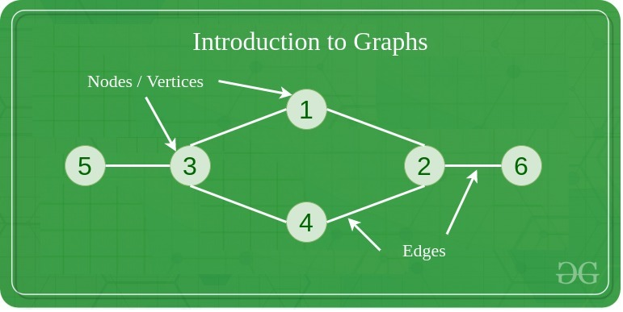
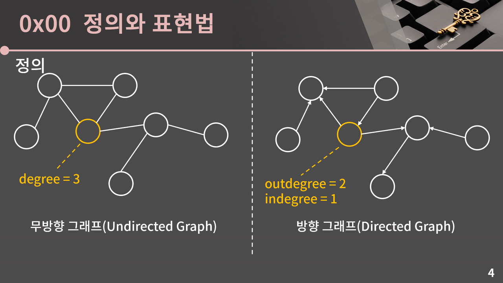
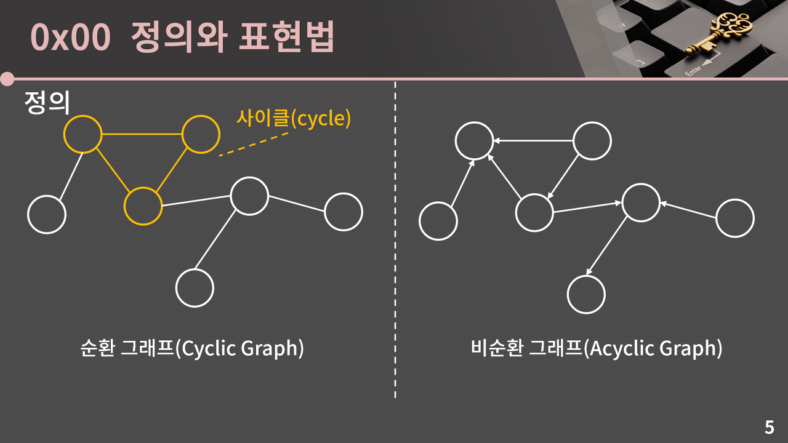
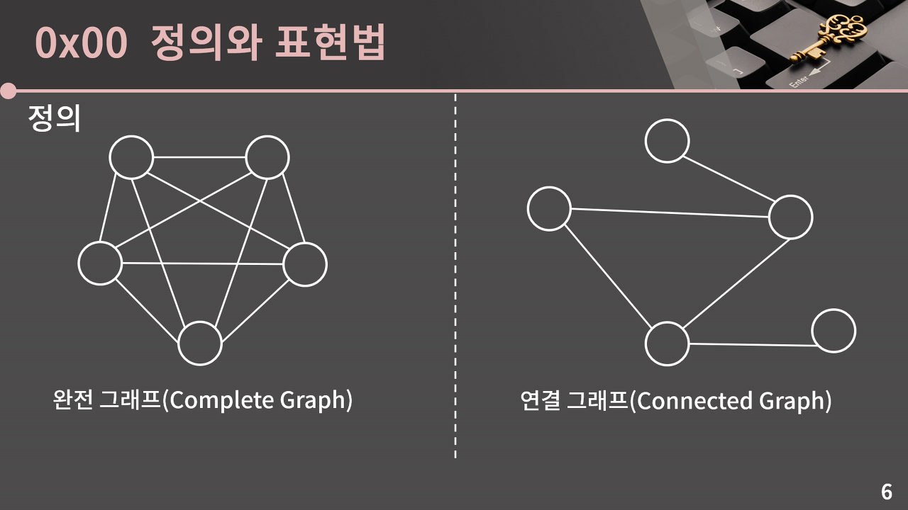
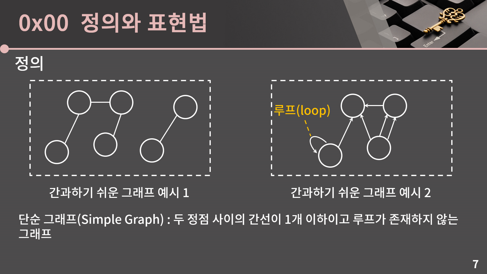
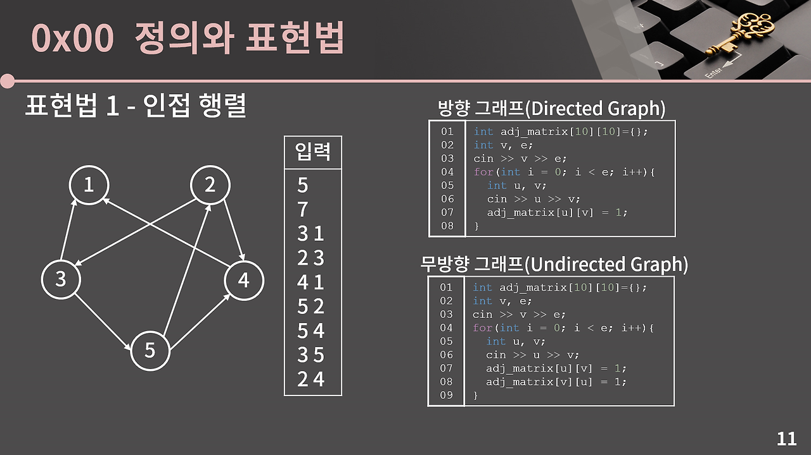
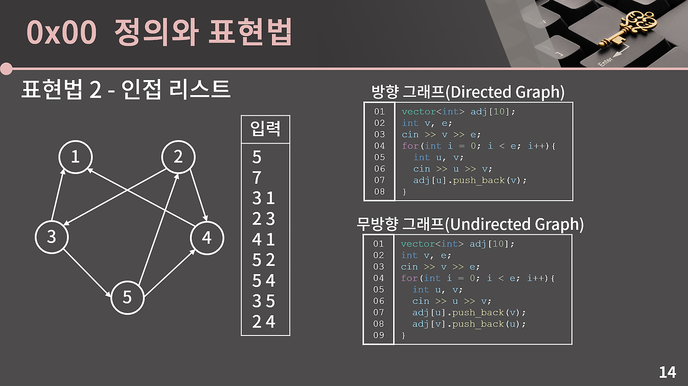
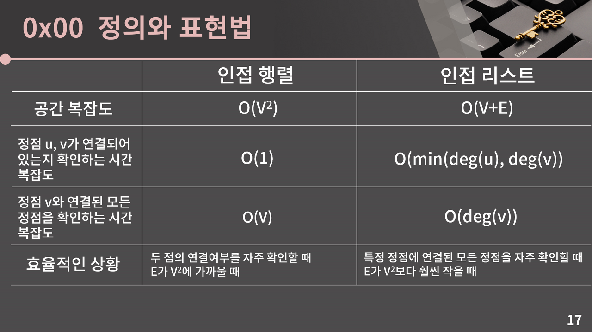

# graph
그래프 = `정점(Vertex/Node)`과 `간선(Edge)`으로 이루어진 자료구조

[출처](https://www.geeksforgeeks.org/graph-data-structure-and-algorithms/)
- 원소 사이의 `연결 관계`를 설정하는 상황에서 유용한 알고리즘

### 차수
각 정점에 대해 간선으로 연결된 이웃한 정점의 개수

### 방향 그래프, 무방향 그래프

[출처](https://blog.encrypted.gg/1016)

### 순환 그래프, 비순환 그래프

[출처](https://blog.encrypted.gg/1016)

### 완전 그래프, 연결 그래프

[출처](https://blog.encrypted.gg/1016)
- 완전 그래프: 모든 서로 다른 두 정점 쌍이 간선으로 연결된 그래프
- 연결 그래프: 임의의 두 정점 사이에 경로가 항상 존재하는 그래프

### 단순 그래프

[출처](https://blog.encrypted.gg/1016)
## 그래프 표현법
### 1. 인접 행렬

[출처](https://blog.encrypted.gg/1016)
### 2. 인접 리스트
- 정점이 많고 간선이 적은 상황
- 공간 절약

[출처](https://blog.encrypted.gg/1016)
### 비교

- 일반적인 그래프 문제에서 정점 u, v가 연결되어 있는지를 반복적으로 확인하는 경우는 별로 없음
  - 인접 리스트로 그래프를 나타내는 것이 유리한 상황이 더 많다
  - 플로이드 알고리즘 쓸 때에는 인접행렬 쓸 수도

참고: [바킹독 실전 알고리즘](https://blog.encrypted.gg/1016)