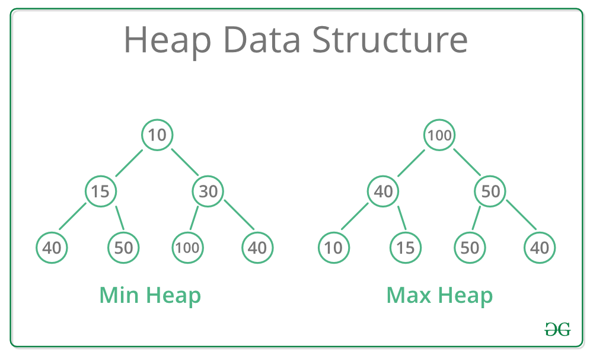

# 우선순위 큐
키워드: `#힙`

우선순위가 높은 데이터가 먼저 나온다.

## 구현 방법: 힙
> 💡 Heap(최대 힙)
> - 완전 이진 트리
> - 부모 노드 >= 자식 노드

[출처](https://www.geeksforgeeks.org/heap-data-structure/)

### INSERT
1. 새로운 노드 x를 가장 `마지막` 위치에 저장
2. 제대로 된 위치를 찾을 때까지
   1. 부모노드와 우선순위 비교해서 x가 우선순위가 더 높으면 자리를 바꾼다.

### DELETE
우선순위 큐에서의 삭제는 `루트 노드`의 삭제를 의미
1. 루트 노드 삭제
2. `마지막 노드`를 `루트 노드` 자리로 이동
3. 제대로 된 위치를 찾을 때까지 자식노드와 비교

### 배열, 연결 리스트로 우선순위 큐를 구현했을 때와 비교
|        | 배열   | 연결리스트 | 힙      |
|:------:|:----:|:-----:|:------:|
| INSERT | O(n) | O(n)  | O(lgn) |
| DELETE | O(1) | O(1)  | O(lgn) |

## 힙의 구현
`배열`로 구현하는 것이 원칙
- 연결 리스트로 구현하면 새로운 노드를 힙의 `마지막 위치`에 추가하는 것이 어렵다
- 완전 이진 트리는 배열로 구현하는 것이 유리하다

- [X] 0번째 인덱스는 사용하지 않는다.
- [X] 왼쪽 자식 노드 = 부모 노드 * 2
- [X] 오른쪽 자식 노드 = 부모 노드 * 2 + 1
- [X] 부모 노드 = 자식 노드 / 2

## Priority Queue STL
- priority_queue는 default가 최대 힙
- 최소 힙 선언 방법
  ```c++
  priority_queue<int, vector<int>, greater<>> pq;
  ```

## 관련 문제
[BOJ14729](https://)


참고 </br>
[1] 윤성우의 열혈 자료구조 </br>
[[2] 바킹독 실전 알고리즘](https://blog.encrypted.gg/1015)