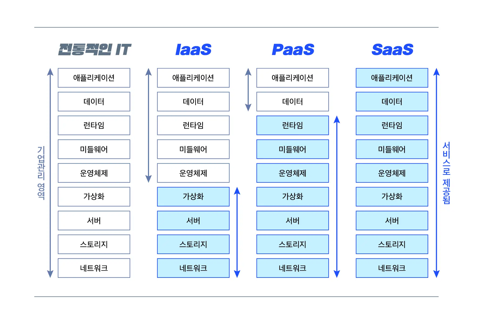

# 클라우드 서비스
키워드: `#Iaas`, `#PaaS`, `#SaaS`

### 클라우드 컴퓨팅
- `인터넷`으로 가상화된 `IT 리소스`를 서비스로 제공
  - 리소스: 서버, 플랫폼, 소프트웨어

## IaaS
Infrastructure as a Service : 서비스로 제공하는 인프라스트럭처
- `컴퓨팅 리소스`(서버, 네트워크, 스토리지를 가상화) 제공
- 클라이언트가 os, 미들웨어, 데이터, 애플리케이션 리소스 관리

> 예시: AWS EC2, MicroSoft Azure

## PaaS
Platform as a Service : 서비스로 제공하는 플랫폼
- 응용 프로그램 `개발`시 필요한 플랫폼 제공
- os, 미들웨어, 런타임을 가상화 하여 제공

> 예시: Heroku, Google App Engine

## SaaS
Software as a Service : 서비스로 제공하는 소프트웨어
- 클라이언트는 다운로드나 설치가 필요하지 않음

> 예시: 구글 독스, 드롭박스

## 장단점 비교
||IaaS|PaaS|SaaS|
|-|----|----|----|
|장점|물리적 자원 규모의 확장 축소가 자유롭다 |CSP가 HW와 필요한 것 관리 |CSP가 모든 것을 관리, 설치 불필요|
|단점|직접 구성하고 유지관리해야 하므로 전문성 필요|특정 플랫폼에 종속될 수 있다|커스터마이징이 어렵다|

* CSP(Cloud Service Provider): 클라우드 서비스 제공업체

참고

[클라우드 서비스 이해하기 IaaS, PaaS, SaaS](https://www.whatap.io/ko/blog/9/)