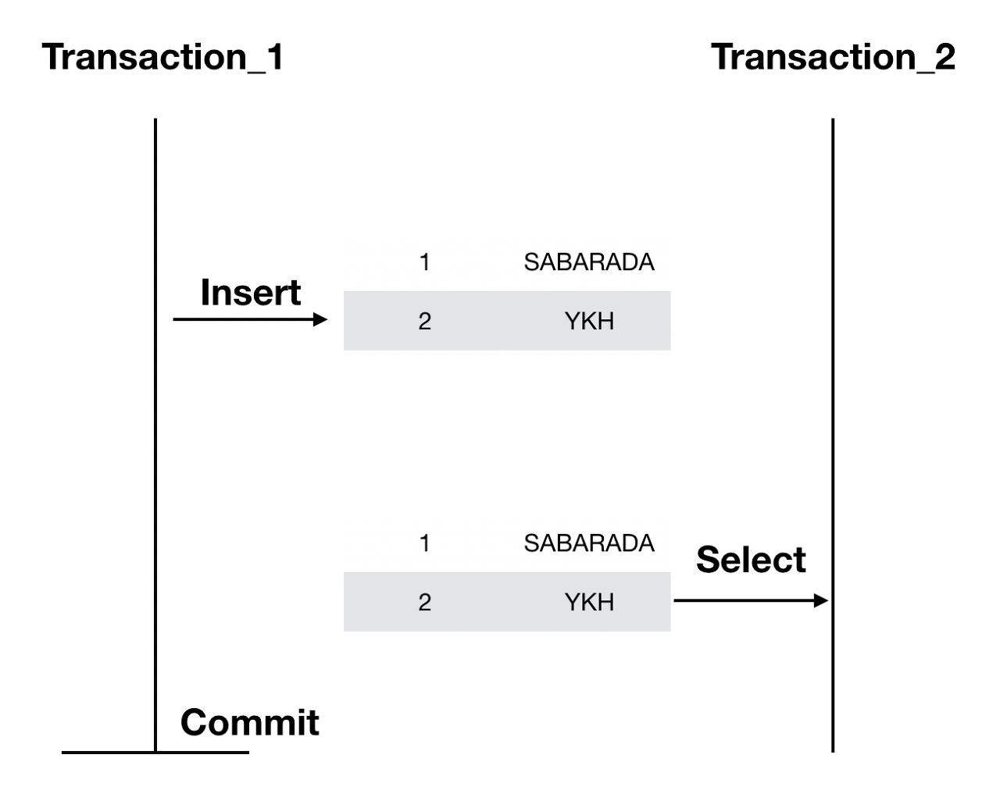
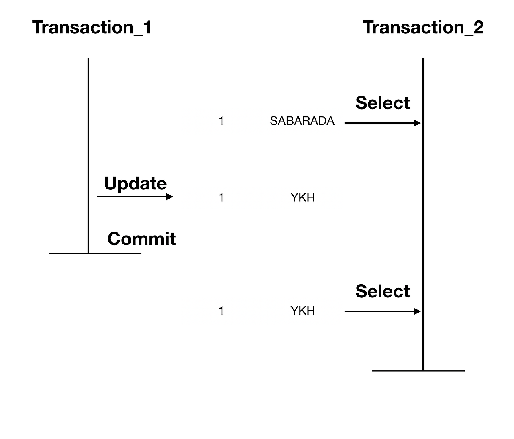
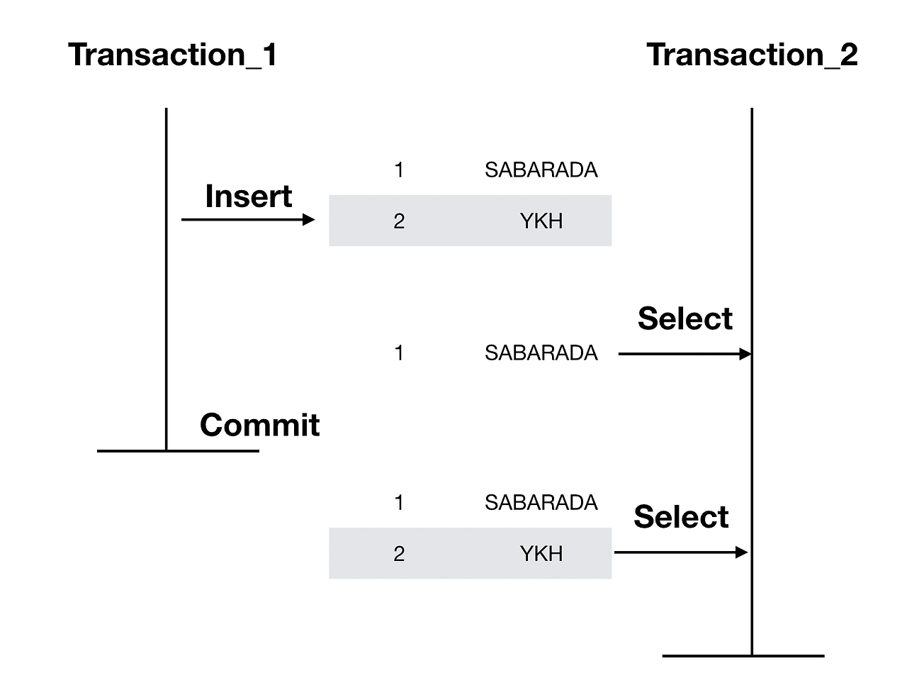

# 트랜잭션 격리 수준
키워드: `#ACID`, `#isolation`, `#일관성`, `#4가지`, `#각 수준에 따라 발생하는 문제`

- 데이터베이스 `ACID` 중 Isolation에 해당
- 여러 트랜잭션이 `동시`에 변경을 수행할 때 데이터의 `일관성`을 보장하기 위함

[1. READ UNCOMMITED](#1-read-uncommited)  
[2. READ COMMITED](#2-read-commited)  
[3. REPEATABLE READ](#3-repeatable-read)  
[4. SERIALIZABLE](#4-serializable)

## 1. READ UNCOMMITED
- 가장 낮은 격리 수준
- 한 트랜잭션이 데이터를 수정 중일 때에도, 다른 트랜잭션이 커밋되지 않은 데이터를 읽을 수 있다
### 발생 가능한 문제
`Dirty Read`, `Non-Repeatable Read`, `Phantom Read`
### Dirty Read
- 다른 트랜잭션에 의해 수정됐지만, 아직 커밋되지 않은 데이터 읽기

[출처](https://sabarada.tistory.com/117)
- transaction 1이 정상처리 되지 않아 `rollback`할 경우 transaction 2는 잘못된 값으로 로직처리
## 2. READ COMMITED
- 커밋된 데이터만 읽을 수 있다
- Dirty Read 해결
- 커밋되지 않은 데이터는 `언두로그`에서 가져온다
### 발생 가능한 문제
`Non-Repeatable Read`, `Phantom Read`
### Non-Repeatable Read
- 한 트랜잭션 내에서 같은 키를 가진 row를 두 번 읽었는데(SELECT) 그 사이 값이 변경되거나 삭제되어 결과가 다르게 나타나는 현상

[출처](https://sabarada.tistory.com/117)
## 3. REPEATABLE READ
- 한 트랜잭션이 읽은 데이터는 그 트랜잭션이 종료될 때까지 다른 트랜잭션에 의해 수정될 수 없다.
- 한 트랜잭션 내에서 동일한 결과를 보장하여 Non-Repeatable Read 해결
- BUT, 새로운 레코드가 추가되는 경우 부정합 발생 가능
- MySQL InnoDB에서 기본값으로 제공하는 격리 레벨
### 발생 가능한 문제
`Phantom Read`
### Phantom Read
- 한 트랜잭션 내에서 같은 쿼리를 두 번 수행했는데, 첫 번째 쿼리에서 없던 유령(Phantom) 레코드가 두 번째 쿼리에서 나타나는 현상

[출처](https://sabarada.tistory.com/117)
## 4. SERIALIZABLE
- 가장 높은 수준의 격리 레벨
- 트랜잭션 내에서 쿼리를 두 번 이상 수행할 때, 첫 번째 쿼리에 있던 레코드가 사라지거나 값이 바뀌지 않음은 물론 새로운 레코드가 나타나지도 않음

 
참고

[[1] 트랜잭션과 격리성](https://sabarada.tistory.com/117)  
[[2] Tecoble: 트랜잭션 격리 수준](https://tecoble.techcourse.co.kr/post/2022-11-07-mysql-isolation/)  
[[3] [MySQL] 트랜잭션의 격리 수준(Isolation Level)에 대해 쉽고 완벽하게 이해하기](https://mangkyu.tistory.com/299)
