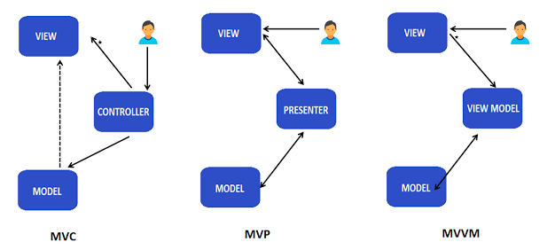
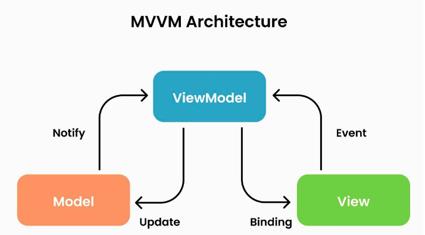

# MVVM 패턴
키워드: `#Model`, `#View`, `#ViewModel`

`Model`, `View`, `View Model`을 분리해 뷰와 모델간의 의존성을 줄인 패턴.

### Model
`데이터`를 다루는 부분. `비즈니스 로직` 포함.

### View
`사용자 인터페이스`

### ViewModel
`View`와 `Model`사이에서 중재자 역할
- `View`에서 발생하는 이벤트 감지→비즈니스 로직 실행

- `Model`과 상호작용하여 데이터 가져오거나 업데이트, `View`와 상호작용하여 데이터를 업데이트
  
- `View`에 표시할 데이터를 가공하여 제공

### Data Binding
`View`와 `ViewModel` 사이 데이터 흐름을 자동으로 처리하는 메커니즘

- 양방향 바인딩: `ViewModel`의 속성이 변경되면 `View`의 UI가 자동으로 업데이트, `View`에서 UI 입력 발생하면 `ViewModel` 속성 업데이트
- 이벤트 처리: 사용자 이벤틑와 `ViewModel`의 command를 연결 가능

## MVVM 동작 방법

`View`->`ViewModel`->`Model` (A->B: A가 B 소유)

1. `View`에서 action을 `ViewModel`에 전달

2. `ViewModel`에서 `Model`에 데이터 요청

3. `Model`에서 `ViewModel`에게 요청받은 데이터 응답

4. `ViewModel`은 응답받은 데이터를 가공하여 `View`에게 전달

5. `View`는 `Data Binding`을 이용해 UI를 갱신

## 장점
- `View`로직과 비즈니스 로직을 분리하여 생산성
- 테스트 용이
- 유연성과 확장성

참고  
[[디자인 패턴] MVVM 패턴이란?](https://velog.io/@kyeun95/%EB%94%94%EC%9E%90%EC%9D%B8-%ED%8C%A8%ED%84%B4-MVVM-%ED%8C%A8%ED%84%B4%EC%9D%B4%EB%9E%80)

