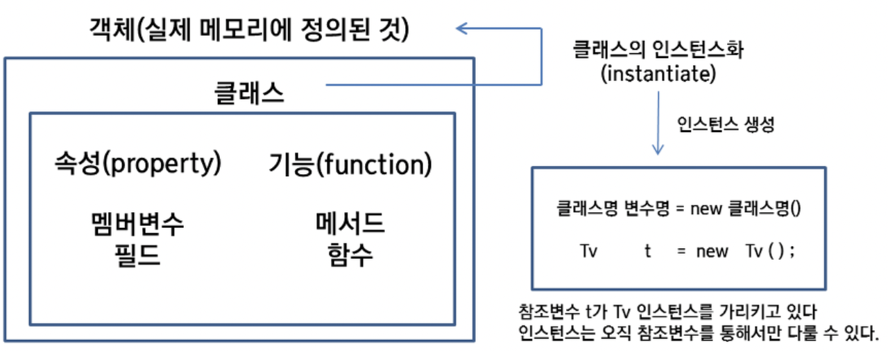

# 클래스와 객체, 인스턴스

## 클래스
- 객체를 생성하기 위한 `설계도`
- 객체가 가지는 `속성`과 `행위`로 이루어짐
- Java 실행시 클래스는 `JVM` 메모리의 `클래스 영역`(Class Area)에 로드됨

## 객체
자신의 `속성`을 가지고 있고, 다른 것과 `식별 가능`한 것

## 인스턴스
클래스를 `구현`한 실제 `메모리`(힙 영역)에 할당된 것