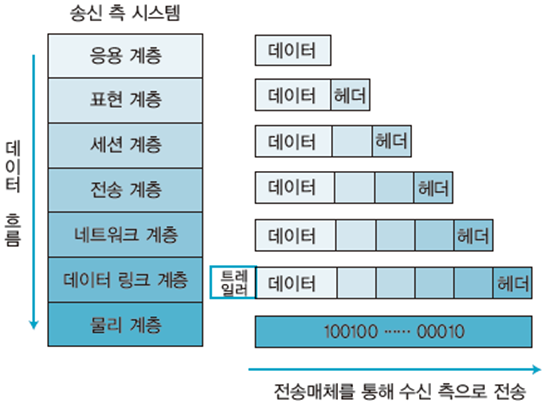
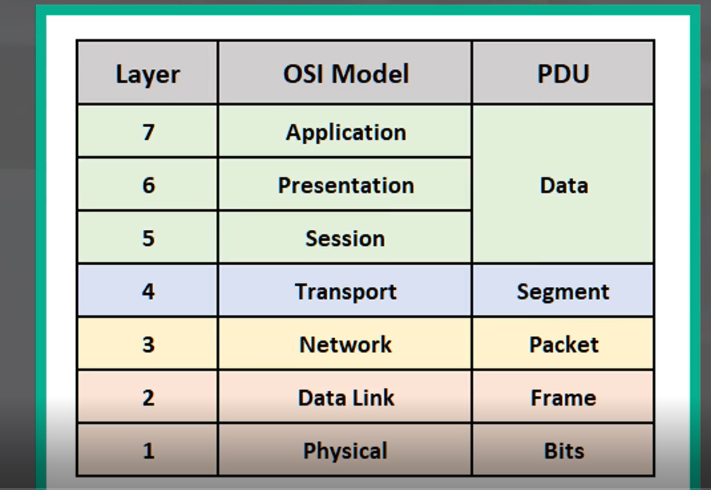

# OSI 7계층
키워드: `#캡슐화`, `#프로토콜`, `#PDU`

- [OSI 7계층](#osi-7계층)
    - [데이터 캡슐화(data capsulation)](#데이터-캡슐화data-capsulation)
    - [프로토콜](#프로토콜)
  - [계층](#계층)
    - [\[7계층\] Application Layer](#7계층-application-layer)
    - [\[6계층\] Presentation Layer](#6계층-presentation-layer)
    - [\[5계층\] Session Layer](#5계층-session-layer)
    - [\[4계층\] Transport Layer](#4계층-transport-layer)
    - [\[3계층\] Network Layer](#3계층-network-layer)
    - [\[2계층\] DataLink Layer](#2계층-datalink-layer)
    - [\[1계층\] Physical Layer](#1계층-physical-layer)

---

국제 표준화 기구(ISO)에서 네트워크 통신이 이루어지는 과정을 `7단계`로 나눈 네트워크 표준 모델(개념적 모델)

각 계층은 독립적.
### 데이터 캡슐화(data capsulation)
데이터를 다음 계층으로 보낼 때 `헤더`나 `트레일러`를 붙이는 것

### 프로토콜
데이터를 송수신하기 위해 정한 규칙

## 계층

- `pdu`: Protocol Data Unit
### [7계층] Application Layer
일반적인 응용 서비스 수행
- `HTTP`, `FTP`, `SMTP`, `IMAP`, `POP3`, `Telnet`

### [6계층] Presentation Layer
데이터의 `표현 방식` 결정
- 데이터 변환, 압축, 암호화
- `JPEG`, `MPEG`, `GIF`, `ASCII`

### [5계층] Session Layer
프로세스 및 호스트 간의 연결 유지(세션 유지)
- `API`, `Socket`

### [4계층] Transport Layer
`신뢰성` 있는 데이터 주고 받게 함
- `port`번호 결정
- `TCP/UDP` 전송방식 결정

### [3계층] Network Layer
데이터를 송신부에서 수신부까지 안전하고 빠르게 전달하기 위한 `라우팅` 수행

- 네트워크 계층 장비: `라우터`

- 전송 단위: `패킷`

### [2계층] DataLink Layer
데이터의 오류 검출 및 복구, 데이터의 흐름 관리

- 프레임의 물리적 주소: `MAC` address

- 전송 단위: `프레임`

- 네트워크 장비: `스위치`, `이더넷`, `브리지`

### [1계층] Physical Layer
데이터를 `비트`단위로 변환 후 주고 받음.

- 네트워크 장비: `리피터`, `허브`