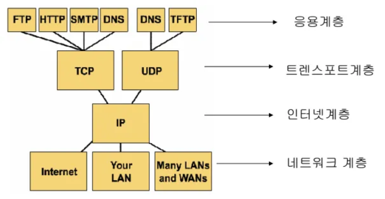

# TCP/IP 4계층
키워드: `#인터넷`, `#TCP`, `#IP`

- [TCP/IP 4계층](#tcpip-4계층)
  - [TCP (Transmission Control Protocol)](#tcp-transmission-control-protocol)
  - [IP (Internet Protocol)](#ip-internet-protocol)
  - [계층](#계층)
    - [\[4계층\] Application Layer](#4계층-application-layer)
    - [\[3계층\] Transport Layer](#3계층-transport-layer)
    - [\[2계층\] Internet Layer](#2계층-internet-layer)
    - [\[1계층\] Network Access Layer](#1계층-network-access-layer)
---

`인터넷`에서 데이터를 주고 받기 위해 사용되는 네트워크 프로토콜

## TCP (Transmission Control Protocol)
패킷의 `전달 여부`와 전송 `순서` 보장

## IP (Internet Protocol)
데이터 조각을 `패킷` 단위로 빠르게 목적지로 보낸다.
- 패킷 순서와 누락 여부 보장X

## 계층

### [4계층] Application Layer
- OSI 7계층의 5~7계층 담당

| Protocol | 내용  |
|----------|-------|
|DNS| 인터넷에서 사용하는 이름을 해당 IP 주소로 변화해주는 서비스|
|SNMP|네트워크 장비를 모니터링하고 제어하는 프로토콜|
|FTP|TCP환경에서 파일 전송 프로토콜|
|HTTP|웹상에서 정보를 주고받을 수 있는 프로토콜|
### [3계층] Transport Layer
- `Application 프로세스` 간 `논리적 통신` 제공
- 양 끝단의 신뢰성 있는 데이터 전송 보장
- `TCP/UDP` 담당 계층
- [TCP와 UDP](tcp_udp.md)

### [2계층] Internet Layer
- `IP` 담당 계층

- OSI 7계층의 `network`

- `패킷` 전송, 경로 설정하여 빨리 보낸다

| Protocol | 내용  |
|----------|-------|
|IP|비연결, 송신지부터 목적지까지 라우팅 경로 결정|
|ICMP|`IP제어`와 메시지 기능|
|ARP|`IP주소`를 이용해 상대방의 `MAC`주소 알아오는 프로토콜 (브로드캐스트 요청, 유니캐스트 응답)|
|RARP|`MAC주소`를 이용해 상대방의 `IP`주소 알아오는 프로토콜 (브로드캐스트 요청, 유니캐스트 응답)|

### [1계층] Network Access Layer
- `node-node`간 신뢰성 있는 데이터 전송
  
- OSI 7계층의 `physical`+`data link`
  
- `MAC`주소를 사용하여 데이터 전달
  
- 데이터를 `전기신호`로 변환