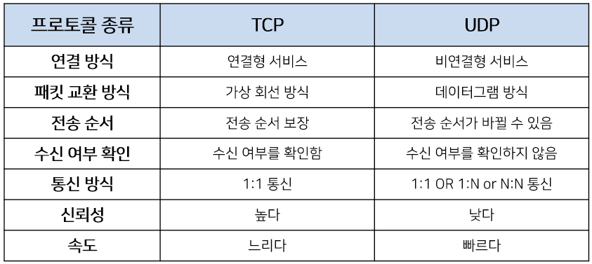

# TCP와 UDP
## TCP
> Transmission Control Protocol
### 특징
1. `연결 지향적` - `3 way handshaking`

2. `흐름 제어`(Flow Control)

3. `혼잡 제어`(Congestion Control)

4. `신뢰성` 보장, `순서` 보장

5. 이런 거 보장해서 `속도 느림`

6. `Full-Duplex`, `Point to Point`

### Three way handshaking
데이터를 전송하기 위해 `연결을 설정`하는 과정(세션 수립)
- 양쪽 모두 데이터를 전송할 준비가 되었다는 것 보장. 

사용되는 플래그: `SYN`, `ACK`
- `SYN`: 연결 설정. 시퀀스 넘버를 랜덤으로 설정하여 전송
- `ACK`: 응답확인. 

#### step 1. 클라이언트는 연결을 요청하기 위해 `SYN`을 보냅니다. (seq: x)
   - Port 상태
     - `Client`: `CLOSED`->`SYN_SENT`
     - `Server`: `LISTEN`

#### step 2. 서버가 SYN을 받고 받았다는 것을 알리기 위해 ACK과 SYN 패킷을 보냅니다. (seq: y, ack: x+1)
   - Port 상태
     - `Client`: `SYN_SENT`
     - `Server`: `SYN_RCV`

#### step 3. 클라언트는 ACK와 SYN을 받고 ACK를 서버로 보냅니다. (ack: y+1)
  - Port 상태
     - `Client`: `ESTABLISHED`
     - `Server`: `ESTABLISHED`

- [X] `full-duplex` 통신
  - Step 1, 2에서는 P→Q 방향에 대한 연결 파라미터(시퀀스 번호)를 설정하고 이를 승인한다.
  - Step 2, 3에서는 Q→P 방향에 대한 연결 파라미터(시퀀스 번호)를 설정하고 이를 승인한다.

### Four way handshaking
`four way handshaking`으로 연결 해제

사용되는 플래그: `FIN`

## UDP
> User Datagram Protocol

데이터를 데이터그램 단위로 처리하는 프로토콜
### 특징
1. 비연결형
   1. 각각의 패킷이 다른 경로로 전송(`독립적`)
   
2. 연결을 설정하고 해제하는 과정 X

3. 흐름 제어 `X`, 혼잡 제어 `X`

4. 빠르다

5. 신뢰성이 낮다

> 연속성이 중요한 실시간 서비스에 좋다
> - 스트리밍

## 비교

참고

[[네트워크] TCP/UDP와 3 -Way Handshake & 4 -Way Handshake](https://velog.io/@averycode/%EB%84%A4%ED%8A%B8%EC%9B%8C%ED%81%AC-TCPUDP%EC%99%80-3-Way-Handshake4-Way-Handshake)