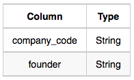
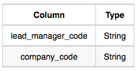
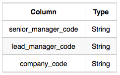
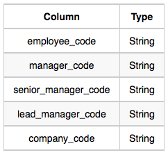

# [HR] New Companies
[링크](https://www.hackerrank.com/challenges/the-company/problem?isFullScreen=true)

## 문제
 write a query to print the `company_code`, `founder name`, `total number of lead managers`, `total number of senior managers`, `total number of managers`, and `total number of employees`. Order your output by ascending company_code.

### tables
 - Company </br>
  
 - Lead_Manager </br>
  
 - Senior_Manager </br>
  
 - Manager </br>
  
 - Employee </br>
  

## 해결과정
처음 풀 때는 Employee-Manager, Manager-Senior...이런 식으로 엮었는데(그러고도 어떻게 해야 하는지 답이 없었음), 

Employee테이블에 각 직무에 누가 있는지 어짜피 뜨기 때문에 테이블을 다 쓸 필요가 없다.


`Company`와 `Employee`만 쓰면 된다.


## 답
```sql
SELECT C.COMPANY_CODE, C.FOUNDER,
COUNT(DISTINCT E.LEAD_MANAGER_CODE),
COUNT(DISTINCT E.SENIOR_MANAGER_CODE),
COUNT(DISTINCT E.MANAGER_CODE),
COUNT(DISTINCT E.EMPLOYEE_CODE)
FROM COMPANY C INNER JOIN EMPLOYEE E
ON C.COMPANY_CODE=E.COMPANY_CODE
GROUP BY C.COMPANY_CODE, C.FOUNDER
ORDER BY C.COMPANY_CODE;
```
