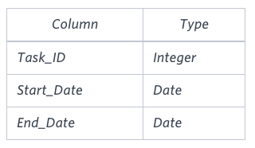
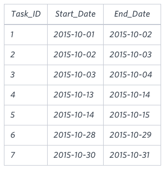

# [HR] Sql Project Planning
[링크](https://www.hackerrank.com/challenges/sql-projects/problem?isFullScreen=true)

## 문제
You are given a table, `Projects`, containing three columns: `Task_ID`, `Start_Date` and `End_Date`. It is guaranteed that the difference between the End_Date and the Start_Date is equal to 1 day for each row in the table.



`If the End_Date of the tasks are consecutive, then they are part of the same project`. Samantha is interested in finding the `total number of different projects` completed.

Write a query to `output the start and end dates` of projects listed by the number of days it took to complete the project in ascending order. If there is more than one project that have the same number of completion days, then order by the start date of the project.

### Sample Example


```SQL
2015-10-28 2015-10-29
2015-10-30 2015-10-31
2015-10-13 2015-10-15
2015-10-01 2015-10-04
```
## 풀이
1. Output의 특징을 찾는다
   
   - 독립적인 프로젝트의 `Start_Date`는 `End_Date`에서 보이지 않는다.
    
     (ex. 10/1일은 `End_Date`에서 보이지 않음)
   
   - `End_Date`의 경우도 마찬가지다.

2. 독립적인 프로젝트의 `Start_Date`를 표시하는 테이블과, `End_Date`를 표시하는 테이블이 필요하다.
    ```SQL
    SELECT START_DATE
    FROM PROJECTS
    WHERE START_DATE NOT IN (SELECT END_DATE FROM PROJECTS)
    ```
    ```SQL
    SELECT END_DATE
    FROM PROJECTS
    WHERE END_DATE NOT IN (SELECT START_DATE FROM PROJECTS)
    ```

3. 위의 두 테이블을 조합한다. 
   - `JOIN`할 때 `Start_Date`는 `End_Date`보다 작다.
   - 그러면 `Start_Date`와 `End_Date`의 여러 조합이 나타나는데, 이 때 가장 이른 `Start_Date`는 가장 이른 `End_Date`와 이어진다.
    ```SQL
    SELECT START_DATE, MIN(END_DATE)
    FROM
    (
        SELECT START_DATE
        FROM PROJECTS
        WHERE START_DATE NOT IN (SELECT END_DATE FROM PROJECTS)
    ) A,
    (
        SELECT END_DATE
        FROM PROJECTS
        WHERE END_DATE NOT IN (SELECT START_DATE FROM PROJECTS)
    ) B
    WHERE START_DATE < END_DATE
    GROUP BY START_DATE
    ORDER BY DATEDIFF(MIN(END_DATE), START_DATE), START_DATE
    ```
