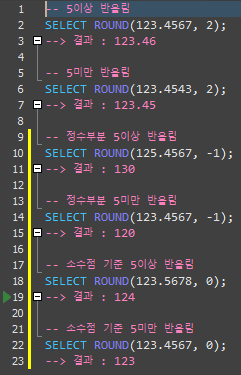

# 반올림, 올림, 내림
키워드: `#ROUND`, `#CEILING`, `#FLOOR`

## ROUND
```SQL
ROUND(숫자, 자릿수, 함수)
ROUND(123.456, 2)   /*123.46*/
```
- 함수(옵션): 생략시 기본 0 / 1일 경우 자릿수 이하 절삭


## CEILING
```SQL
CEILING(숫자)
```

## FLOOR
```SQL
FLOOR(숫자)
```

참고 </br>
[반올림, 올림, 내림](https://omnia-omnibus.tistory.com/4)
